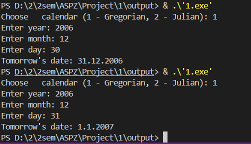
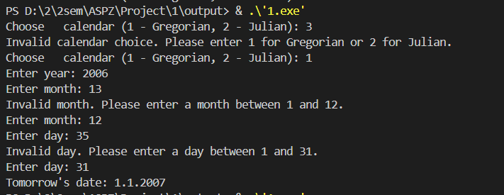
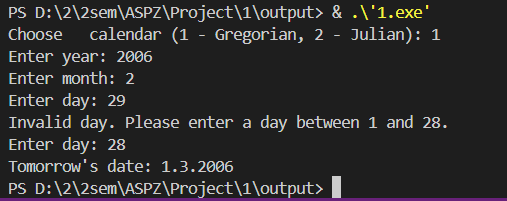

PZ-1

Програма дозволяє користувачу ввести дату та обрати тип календаря, після чого видає дату наступного дня . 

З цікавого: реалізовані два типи календарів — "григоріанський" та "юліанський".  
- "Григоріанський календар" — сучасний календар, який використовується у більшості країн, у ньому високосний рік кожні 4 роки, за винятком століть, які не діляться на 400.  
- "Юліанський календар" — старий календар, у якому високосний рік відбувається кожні 4 роки без винятків.

Особливість введення дати:  
1. Користувач спочатку обирає тип календаря.  
2. Потім вводить "рік", "місяць", і "день" окремо.  
Це зроблено, щоб уникнути хибних даних: наприклад, у лютому програма знає, чи 28 чи 29 днів, залежно від вибраного календаря та року.

