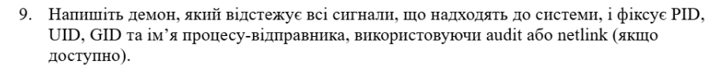
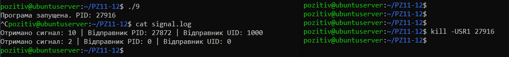

# Варіант №9



`"9.c":`
``` C
#include <stdio.h>
#include <stdlib.h>
#include <unistd.h>
#include <signal.h>
#include <fcntl.h>

void signal_handler(int sig, siginfo_t *info, void *context) {
    int fd = open("signal.log", O_WRONLY | O_CREAT | O_APPEND, 0666);
    if (fd != -1) {
        char buffer[256];
        int len = snprintf(buffer, sizeof(buffer), 
            "Отримано сигнал: %d | Відправник PID: %d | Відправник UID: %d\n", 
            sig, info->si_pid, info->si_uid);
        write(fd, buffer, len);
        close(fd);
    }
    
    if (sig == SIGINT) {
        _exit(0);
    }
}

int main() {
    struct sigaction sa;
    sa.sa_sigaction = signal_handler;
    sa.sa_flags = SA_SIGINFO;
    sigemptyset(&sa.sa_mask);

    sigaction(SIGUSR1, &sa, NULL);
    sigaction(SIGINT, &sa, NULL);

    printf("Програма запущена. PID: %d\n", getpid());
    printf("Очікую сигнали... (Натисни Ctrl+C для виходу)\n");

    while (1) {
        pause();
    }

    return 0;
}
```

Результат:



Написано програму мовою `C`, яка використовує системний виклик `sigaction` з прапорцем `SA_SIGINFO` для перехоплення сигналів `SIGUSR1` та `SIGINT`. Програма коректно витягує інформацію з полів `si_pid` та `si_uid` структури `siginfo_t` при отриманні сигналу. Дані про відправників були успішно та у правильному форматі записані до файлу `signal.log`