# PZ_2

# Завдання №1

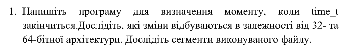

`"1.с":`
``` C
#include <stdio.h>
#include <time.h>
#include <limits.h>

int main() {
    printf("Розмір time_t: %ld байт\n", sizeof(time_t));
    
    time_t max_time = INT_MAX;
    printf("Максимальний час (32-bit): %s", ctime(&max_time));

    return 0;
}
```
Результат:

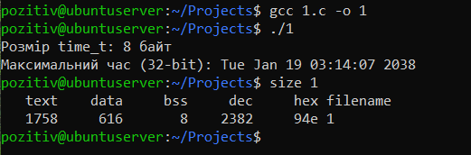

У ході роботи було скомпільовано програму на мові C та проаналізовано її виконуваний файл за допомогою утиліти size. Результат показав розподіл пам’яті за сегментами: text, data та bss.

Сегмент text (1758 байт) містить машинний код програми і займає найбільшу частину файлу. Сегмент data (616 байт) призначений для ініціалізованих глобальних і статичних змінних. Сегмент bss (8 байт) відводиться під неініціалізовані глобальні або статичні змінні і займає мінімальний обсяг, оскільки в програмі такі змінні практично відсутні.

# Завдання №2.2

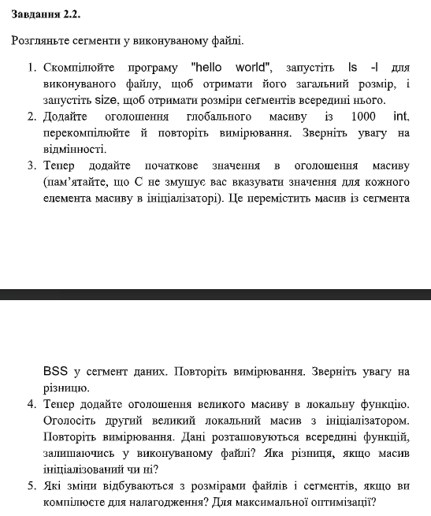

### Пункт 1

``` C
#include <stdio.h>

int main() {
    printf("Hello, world!\n");
    return 0;
}
```
Результат:

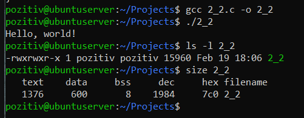

- Загальний розмір (ls): Показує повний обсяг файлу на диску, включаючи службові заголовки операційної системи.
- Сегмент Text: Містить машинний код програми та константні рядки. Це основна частина нашої маленької програми.
- Сегменти Data та BSS: У цій програмі вони мають мінімальні значення, оскільки в коді відсутні глобальні змінні.

Чому size показує менше, ніж ls -l?

Різниця у значеннях виникає тому, що утиліта `size` враховує лише ті частини програми, які безпосередньо завантажуються в оперативну пам'ять під час виконання (сегменти text, data, bss).

У той же час, команда `ls -l` відображає повний фізичний розмір файлу на диску, який, окрім самих сегментів

### Пункт 2-3

``` C
#include <stdio.h>

int arr[1000];

int main() {
    printf("Hello, world!\n");
    return 0;
}
```
Результат:

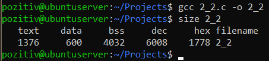

``` C
#include <stdio.h>

int arr[1000] = {1};

int main() {
    printf("Hello, world!\n");
    return 0;
}
```
Результат:

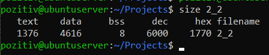

Експеримент 1:
Оголошено глобальний масив `int arr[1000];`.

Результат: Розмір сегмента `bss` збільшився на `~4000 байт`. Розмір файлу на диску практично не змінився.

Висновок: Сегмент `BSS` не займає місця у файлі, оскільки зберігає лише запит на виділення пам'яті при старті.

Експеримент 2 :
Масив ініціалізовано: `int arr[1000] = {1};`.

Результат: Дані перемістилися з `bss` до сегмента `data`. Фізичний розмір файлу на диску збільшився пропорційно розміру масиву.

Висновок: Сегмент `data` зберігає явні значення змінних і фізично присутній у виконуваному файлі.

### Пункт 4

``` C
#include <stdio.h>

int main() {
    int local_arr[1000]; 
    
    printf("Hello, world!\n");
    return 0;
}
```
Результат:

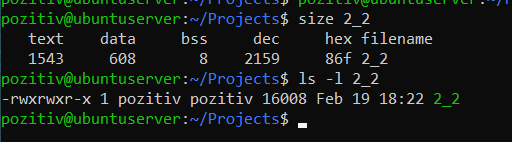

Експеримент:
Великий масив `int arr[1000]` був перенесений із глобальної області всередину функції `main()`.

Результати:

Команди `size` та `ls` показали відсутність значних змін у сегментах `data` та `bss`.

Висновок:
На відміну від глобальних змінних, локальні змінні не зберігаються у сегментах виконуваного файлу. Вони створюються динамічно під час виконання програми.

# Завдання №2.3

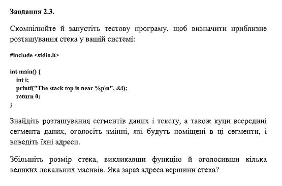

``` C
#include <stdio.h>

int main() {
int i;
printf("The stack top is near %p\n", (void*)&i);
return 0;
}
```
Результат:

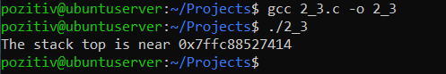


Висновок:

Стек використовується для зберігання локальних змінних. За допомогою виводу адреси локальної змінної &i було встановлено, що стек розташовується за дуже високими адресами пам'яті.

# Завдання №2.4

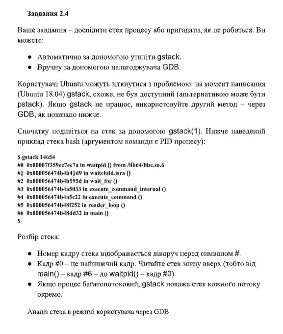

``` C
#include <stdio.h>
#include <stdlib.h>
#include <unistd.h>
#include <sys/types.h>

#define MSG "In function %20s; &localvar = %p\n"

static void bar_is_now_closed(void) {
    int localvar = 5;
    printf(MSG, __FUNCTION__, (void*)&localvar);
    printf("\n Now blocking on pause()...\n");
    
    pause(); 
}

static void bar(void) {
    int localvar = 5;
    printf(MSG, __FUNCTION__, (void*)&localvar);
    bar_is_now_closed(); 
}

static void foo(void) {
    int localvar = 5;
    printf(MSG, __FUNCTION__, (void*)&localvar);
    bar(); 
}

int main(int argc, char **argv) {
    int localvar = 5;
    
    printf(MSG, __FUNCTION__, (void*)&localvar);
    
    foo();
    
    exit(EXIT_SUCCESS); 
}
```
Результат:

.png)

Хід виконання:

- Було написано програму з ланцюжком вкладених функцій `main -> foo -> bar -> bar_is_now_closed`, яка зупиняється системним викликом `pause()`.
- Програму було скомпільовано та запущено. За допомогою команди `ps` було знайдено PID процесу.

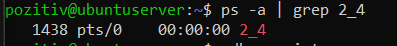

- Через обмеження безпеки Linux підключення налагоджувача потребувало прав суперкористувача (sudo gdb).
- Після успішного підключення до процесу командою attach було виконано команду backtrace.

.png)

Аналіз результату:

- Кадр #0: Поточний стан процесу — системна функція pause, яка очікує сигналу.
- Кадри #1–#4: Показують ієрархію викликів. Кожна функція зберігає в стеку свою адресу повернення та контекст локальних змінних.

# Завдання (Варіант №10)

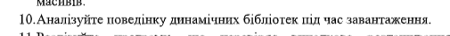

### Теорія до завдання:

Динамічні бібліотеки (Shared Libraries, у Linux — файли з розширенням .so) — це зовнішні об'єктні файли, що містять скомпільований код та дані, які можуть бути використані кількома програмами одночасно.

- Основні принципи функціонування:
Відкладене зв'язування: На відміну від статичних бібліотек, код динамічних бібліотек не включається у фінальний бінарний файл програми (a.out або .exe) на етапі компіляції. Це дозволяє суттєво зменшити розмір виконуваного файлу на диску.
- Динамічне завантаження: Підключення бібліотек відбувається безпосередньо під час запуску програми або під час її виконання. Цим процесом керує спеціальний компонент операційної системи — динамічний завантажувач (linker).
- Відображення в адресному просторі (VAS): У віртуальному адресному просторі процесу для динамічних бібліотек виділяється спеціальна область (Shared Libraries Mapping Area). Вона розташовується між сегментом Stack (високі адреси) та сегментами коду й даних основної програми (низькі адреси).

### Експеремент:

``` C
#include <stdio.h>

int global = 100;

int main() {
    int stack = 10;
    printf("Адреса stack (Stack):    %p\n", (void*)&stack);
    printf("Адреса printf (Library): %p\n", (void*)printf);
    printf("Адреса global (Data):    %p\n", (void*)&global);

    return 0;
}
```
Результат:

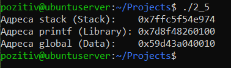

### Висновок:
В ході експерименту було отримано практичне підтвердження теоретичної моделі віртуального адресного простору процесу. Аналіз адрес показав чітку ієрархію розташування сегментів:

- Вершина стека зафіксована за адресою `0x7ffc5f54e974`, що відповідає області найвищих адрес пам'яті.
- Динамічна бібліотека (функція printf) була завантажена за адресою `0x7d8f48260100`. Це підтверджує, що Shared Libraries відображаються у проміжок нижче стека, але вище основних сегментів програми.
- Глобальні дані розташовані за значно нижчою адресою — `0x59d43a040010`, що характерно для сегментів data/text.
