# Завдання №3.1

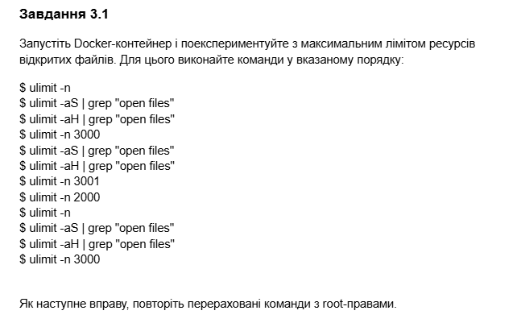

##### Що таке `ulimit`?

Це вбудована команда, яка показує або встановлює обмеження на ресурси, доступні оболонці (shell) та процесам, які вона запускає.

Результат:

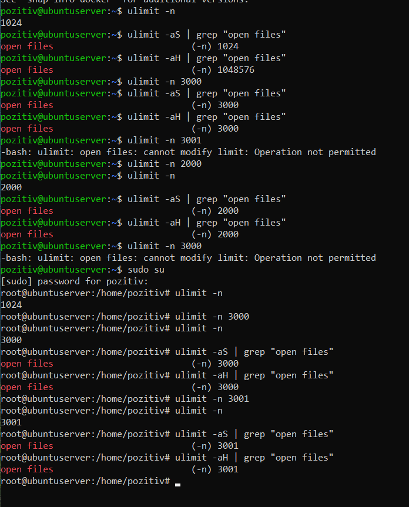

У ході експерименту було зафіксовано, що звичайний користувач може вільно знижувати ліміти, але спроба встановити значення навіть на одиницю вище за жорсткий ліміт (спроба встановити 3001 при ліміті 3000) блокується системою з помилкою `Operation not permitted`. Використання прав `root` дозволило ігнорувати ці обмеження.

# Завдання №3.2

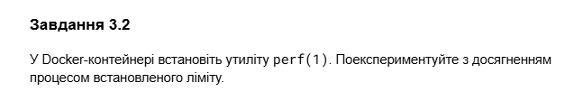

Результат:

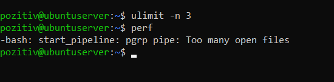

При встановленні ліміту `ulimit -n 3` система виявилася нездатною запустити навіть базові команди. Програма видала помилку `Too many open files` та повідомила про неможливість завантаження спільних бібліотек. Висновок: кожна програма при запуску потребує мінімальної кількості файлових дескрипторів для своїх внутрішніх потреб (бібліотек, потоків вводу/виводу), і встановлення занадто низьких лімітів призводить до повної непрацездатності софту.

# Завдання №3.3

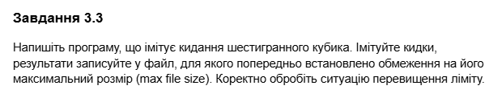

`"3_3.с":`
``` C
#include <stdio.h>
#include <stdlib.h>
#include <time.h>

int main() {
    FILE *fp = fopen("results.txt", "w");
    srand(time(NULL));

    while(1) {
        fprintf(fp, "%d ", rand() % 6 + 1);
        fflush(fp);
    }

    return 0;
}
```

Результат:

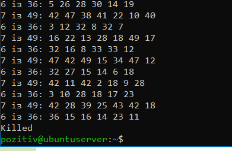

Програма успішно почала запис, проте як тільки розмір файлу спробував перевищити `1024 байти`, операційна система надіслала сигнал переривання, і виконання завершилося з помилкою `File size limit exceeded (core dumped)`. Це демонструє ефективність ліміту `ulimit -f` у запобіганні переповненню дискового простору некоректними або шкідливими процесами.

# Завдання №3.4

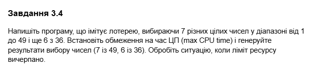

`"3_4.с":`
``` C
#include <stdio.h>
#include <stdlib.h>
#include <time.h>

void generate_lottery(int count, int max) {
    printf("%d із %d: ", count, max);
    for (int i = 0; i < count; i++) {
        printf("%d ", (rand() % max) + 1);
    }
    printf("\n");
}

int main() {
    srand(time(NULL));

    while(1) {
        generate_lottery(7, 49);
        generate_lottery(6, 36);
    }

    return 0;
}
```

Результат:


При чистому обчислювальному навантаженні система миттєво зреагувала на вичерпання ліміту, примусово завершивши процес статусом `Killed`. Висновок: параметр `ulimit -t` контролює саме "чистий" процесорний час (CPU time), що дозволяє обмежувати цикли, які зациклилися, не заважаючи при цьому роботі інших процесів.

# Завдання №3.5

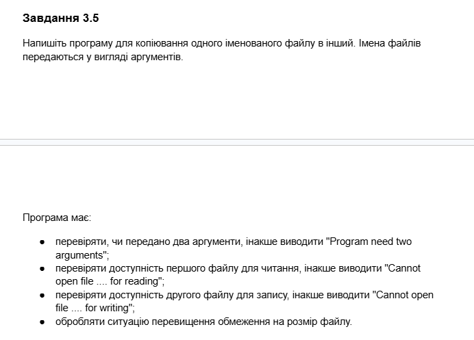

`"3_5.с":`
``` C
#include <stdio.h>
#include <stdlib.h>

int main(int argc, char *argv[]) {
    if (argc != 3) {
        printf("Program need two arguments\n");
        return 1;
    }

    FILE *src = fopen(argv[1], "r");
    if (src == NULL) {
        printf("Cannot open file %s for reading\n", argv[1]);
        return 1;
    }

    FILE *dest = fopen(argv[2], "w");
    if (dest == NULL) {
        printf("Cannot open file %s for writing\n", argv[2]);
        fclose(src);
        return 1;
    }

    int ch;
    while ((ch = fgetc(src)) != EOF) {
        if (fputc(ch, dest) == EOF) {
            perror("\nError writing to file (possibly limit exceeded)");
            break;
        }
    }

    printf("Копіювання завершено (або перервано лімітом).\n");
    fclose(src);
    fclose(dest);
    return 0;
}
```

Результат:

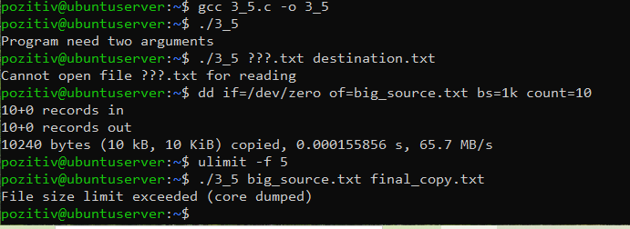

Програма коректно вивела повідомлення `Program need two arguments` при запуску без параметрів та `Cannot open file...` при зверненні до неіснуючих або захищених об'єктів. При спрацюванні ліміту `ulimit -f` було зафіксовано аварійне завершення, що підтверджує пріоритет системних обмежень над логікою прикладного ПЗ.


# Завдання №3.6


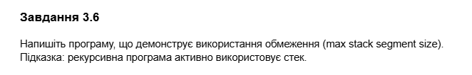

`"3_6.с":`
``` C
#include <stdio.h>

void rec(int x) {
    char buffer[1024];

    for (int i = 0; i < 1024; i++) {
        buffer[i] = i;
    }

    printf("№: %d\n", x);

    rec(x + 1);
}

int main() {
    rec(1);
    return 0;
}
```

Результат:

.png)

.png)

При стандартному ліміті програма досягла значної глибини рекурсії `7699`, тоді як при ліміті 100 КБ виконання перервалося майже миттєво, дійшовши лише до `87` . Це наочно демонструє вплив параметра `ulimit -s` на стабільність роботи алгоритмів з глибокою рекурсією або великою кількістю локальних даних.

# Варіант №9

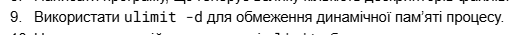

##### Що таке динамічна пам'ять?
Це область пам'яті , де програма зберігає дані під час виконання (наприклад, коли ми використовуєш malloc у C). Параметр ulimit -d обмежує максимальний розмір цього сегмента.

`"9.с":`
``` C
#include <stdio.h>
#include <stdlib.h>
#include <string.h>

int main() {
    size_t size = 10 * 1024 * 1024; 
    printf("Спроба виділити %zu байт динамічної пам'яті...\n", size);

    char *ptr = (char *)malloc(size);

    if (ptr == NULL) {
        printf("Помилка: Не вдалося виділити пам'ять! (Обмеження спрацювало)\n");
        return 1;
    } else {
        printf("Пам'ять успішно виділена.\n");
        memset(ptr, 0, size); 
        free(ptr);
    }

    return 0;
}
```

Результат:

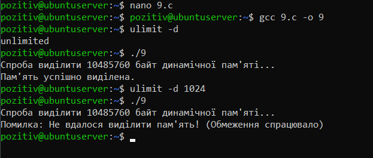

При відсутності обмежень програма успішно виділила необхідний обсяг пам'яті. Однак після встановлення ліміту `ulimit -d 1024` запит на виділення `10 МБ` було відхилено, внаслідок чого функція `malloc` повернула порожній покажчик `NULL`, а програма вивела повідомлення про помилку. Висновок: параметр `ulimit -d` дозволяє ефективно контролювати споживання оперативної пам'яті окремими процесами, що є критично важливим для стабільності багатокористувацьких систем та Docker-контейнерів.
