# Завдання №4.1

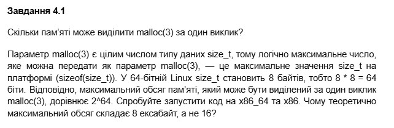

`"4_1.с":`
``` C
#include <stdio.h>
#include <stdlib.h>
#include <stdint.h>

int main() {
    printf("Розмір size_t на цій системі: %zu байтів\n", sizeof(size_t));
    
    printf("Максимальне значення size_t (SIZE_MAX): %lu\n", SIZE_MAX);

    return 0;
}
```

Результат:


##### Чому 8 ексабайт, а не 16?

В Linux адресний простір зазвичай ділиться навпіл: 8 ексабайт віддається під потреби операційної системи (ядро), а інші 8 ексабайт залишаються доступними для програм користувача.

# Завдання №4.2

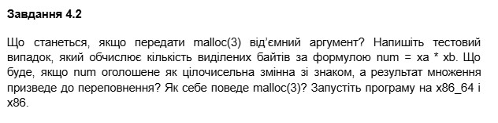

`"4_2.с":`
``` C
#include <stdio.h>
#include <stdlib.h>

int main() {

    printf("malloc(-1): \n");

    void *ptr1 = malloc(-1);

    if (ptr1 == NULL) {
        printf("malloc(-1) повернув NULL \n\n");
    } else {
        printf("malloc(-1) виділив пам'ять за адресою %p\n\n", ptr1);
        free(ptr1);
    }

    int xa = 1000000;
    int xb = 1000000;
    int num = xa * xb;

    printf("--- Переповнення при множенні ---\n");
    printf("xa = %d, xb = %d\n", xa, xb);
    printf("Результат num (int): %d\n", num);

    void *ptr2 = malloc(num);
    if (ptr2 == NULL) {
        printf("malloc(%d) повернув NULL\n", num);
    } else {
        printf("malloc(%d) виділив пам'ять за адресою %p\n", num, ptr2);
        free(ptr2);
    }

    return 0;
}
```

Результат:

.png)

.png)

- Спроба `malloc(-1)`: Компілятор `gcc` видав попередження, оскільки аргумент `-1` був автоматично приведений до типу `size_t` і став дорівнювати числу що перевищує ліміт адресації, тому `malloc` повернув `NULL`.
- Переповнення при множенні: При множенні `1000000 * 1000000` у змінній типу int, замість великого числа було отримано від'ємне число `-727,379,968`. Оскільки `malloc` отримав від'ємне значення (яке знову ж таки трактується як величезне беззнакове число), він не зміг знайти такий обсяг вільної пам'яті та повернув `NULL`.

# Завдання №4.3

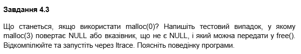

`"4_3.с":`
``` C
#include <stdio.h>
#include <stdlib.h>

int main() {
    printf("Виклик malloc(0)...\n");
    void *ptr = malloc(0);

    if (ptr == NULL) {
        printf("malloc(0) повернув NULL\n");
    } else {
        printf("malloc(0) повернув адресу: %p\n", ptr);
        printf("Звільняємо пам'ять через free()...\n");
        free(ptr);
        printf("Пам'ять успішно звільнена.\n");
    }

    return 0;
}
```

Результат:

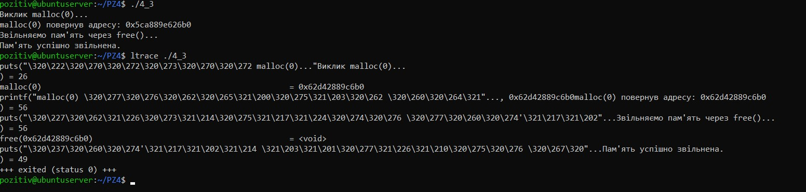

- На моїй системі `malloc(0)` не повернув `NULL`. Замість цього була отримана унікальна адреса.
- Отриманий вказівник було успішно передано у функцію `free()`, програма завершилася без помилок.
- Аналіз `ltrace`: Утиліта зафіксувала виклик `malloc(0)` та повернення конкретної адреси. Це підтверджує, що реалізація `glibc` у Linux виділяє мінімально можливий блок пам'яті навіть для нульового запиту.

# Завдання №4.4

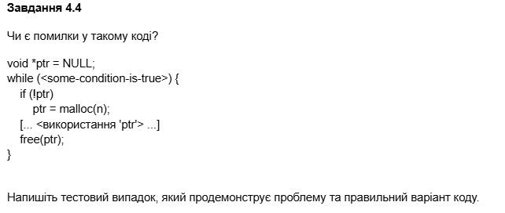

`"4_4.с":`
``` C
#include <stdio.h>
#include <stdlib.h>

int main() {
    void *ptr = NULL;
    int x = 0;

    while (x < 3) {
        printf("№ %d\n", x);
        if (!ptr) {
            printf("Викликаємо malloc(100)\n");
            ptr = malloc(100);
        } else {
            printf("Помилка! ptr не NULL\n");
        }

        printf("ptr = %p\n", ptr);
        printf("Викликаємо free(ptr)\n");
        free(ptr);
        printf("ptr = %p\n", ptr);
        
        x++;
    }
    return 0;
}
```

Результат:

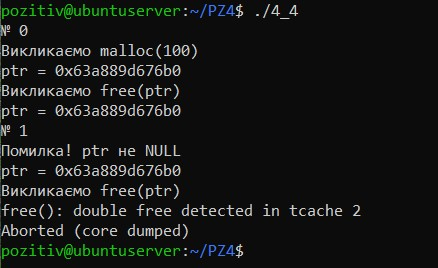

- У коді присутня логічна помилка: після виклику `free(ptr)` пам'ять звільняється, але сам вказівник `ptr` продовжує зберігати стару адресу.
- На наступній ітерації умова `if (!ptr)` повертає "брехню", оскільки вказівник не є нульовим. Програма наприкінці циклу намагається вдруге звільнити ту саму адресу.

Аналіз виконання:

1. №0: `malloc` виділяє адресу `0x63a889d676b0`. Після `free(ptr)` вказівник все ще містить цю адресу.
2. №1: Умова `if (!ptr)` не спрацьовує. Програма викликає `free(0x63a889d676b0)` вдруге.
3. Результат: Система видала помилку `free(): double free detected` і негайно завершила роботу програми

`Правильний варіант коду:`
``` C
free(ptr);
ptr = NULL;
```

# Завдання №4.5


`"4_5.с":`
``` C
#include <stdio.h>
#include <stdlib.h>
#include <stdint.h>

int main() {
    size_t initial_size = 100;
    void *ptr = malloc(initial_size);
    printf("Початкова адреса: %p\n", ptr);

    size_t max_size = SIZE_MAX; 
    printf("Спроба realloc до %zu байтів...\n", max_size);

    void *new_ptr = realloc(ptr, max_size);

    if (new_ptr == NULL) {
        printf("realloc повернув NULL\n");
        printf("ПЕРЕВІРКА: Старий вказівник ptr все ще дійсний: %p\n", ptr);
        
        free(ptr);
        printf("Стару пам'ять звільнено успішно\n");
    } else {
        printf("Успішно розширено до %p\n", new_ptr);
        free(new_ptr);
    }

    return 0;
}
```

Результат:

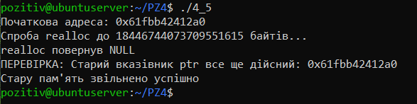

- Програма виділила блок пам'яті за адресою `0x61fbb42412a0`.
- Було здійснено спробу розширити цей блок до максимально можливого значення `size_t`.
- Функція повернула `NULL`, оскільки такий обсяг пам'яті недоступний.
- Після невдалої спроби розширення старий вказівник `ptr` зберіг свою початкову адресу `0x61fbb42412a0`, і пам'ять за цією адресою залишилася доступною для коректного звільнення через `free()`.

Висновок:
Якщо `reallo`c не може задовольнити запит, він повертає `NULL`, але не звільняє оригінальний блок пам'яті. Саме тому важливо завжди використовувати тимчасову змінну для результату `realloc`, щоб не перезаписати (і не втратити) адресу блоку пам'яті у разі помилки.


# Завдання №4.6

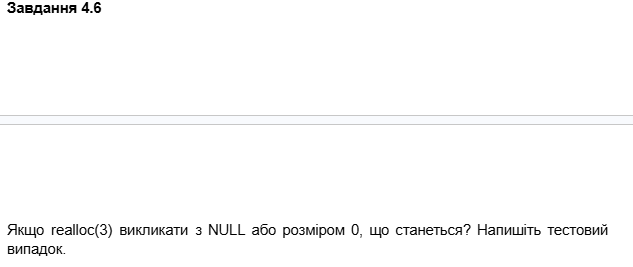

`"4_6.с":`
``` C
#include <stdio.h>
#include <stdlib.h>

int main() {
    printf("Тест 1: realloc(NULL, 100)\n");
    void *ptr1 = realloc(NULL, 100);
    if (ptr1 != NULL) {
        printf("ptr1:  %p\n", ptr1);
        free(ptr1);
    }else {
        printf("realloc(NULL, 100) повернув NULL\n");
    }

    printf("\nТест 2: realloc(ptr, 0)\n");
    void *ptr2 = malloc(100);
    printf("Викликаємо: *ptr2 = malloc(100)\n");
    printf("ptr2: %p\n", ptr2);
    
    printf("Викликаємо: *ptr3 = realloc(ptr2, 0)\n");
    void *ptr3 = realloc(ptr2, 0);
    printf("ptr3: %p\n", ptr3);

    if (ptr3 != NULL) {
        free(ptr3);
        printf("Звільнено адресу, яку повернув realloc(ptr, 0)\n");
    } else {
        printf("realloc повернув NULL\n");
    }

    return 0;
}
```

Результат:

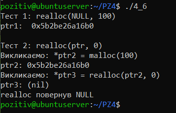

- Тест 1 `realloc(NULL, 100)`: При передачі NULL замість чинного вказівника, функція спрацювала як звичайний `malloc`. Було успішно виділено пам'ять за адресою `0x5b2be26a16b0`.
- Тест 2 `realloc(ptr, 0)`:
1. Спочатку було виділено блок за адресою `0x5b2be26a16b0`.
2. Після виклику `realloc(ptr2, 0)` функція повернула (nil) (NULL).
3. Це свідчить про те, що система звільнила стару пам'ять і, згідно зі своєю внутрішньою логікою, не стала виділяти новий мінімальний блок, а просто повернула нульовий вказівник.

Висновок:

- Виклик `realloc(NULL, size)` є еквівалентним `malloc(size)`.
- Виклик `realloc(ptr, 0)` призводить до звільнення пам'яті (як free).

# Завдання №4.7

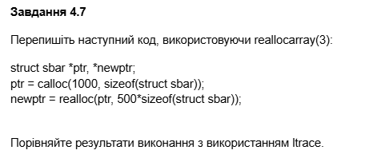

`"4_7.с":`
``` C
#include <stdio.h>

void rec(int x) {
    char buffer[1024];

    for (int i = 0; i < 1024; i++) {
        buffer[i] = i;
    }

    printf("№: %d\n", x);

    rec(x + 1);
}

int main() {
    rec(1);
    return 0;
}
```

Результат:

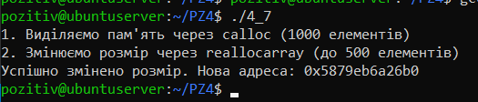

- Програма успішно виконала `calloc` для 1000 елементів структури `sbar`, а потім використала `reallocarray` для зміни розміру до 500 елементів.
- Адресація: Нова адреса об'єкта після зміни розміру — `0x5ed3902a36b0`.
- На відміну від стандартного `realloc(ptr, count * size)`, функція `reallocarray(ptr, 500, sizeof(struct sbar))` автоматично перевіряє множення аргументів на предмет цілочисельного переповнення перед спробою виділення пам'яті.

# Варіант №9

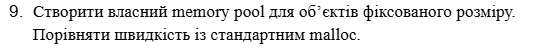

`"9.с":`
``` C
#include <stdio.h>
#include <stdlib.h>
#include <time.h>

#define ITEMS 1000000
#define ITEM_SIZE 64 

int main() {
    clock_t start, end;

    printf("Тест 1: Стандартний malloc\n");
    start = clock();
    for (int i = 0; i < ITEMS; i++) {
        void *p = malloc(ITEM_SIZE); 
        free(p); 
    }
    end = clock();
    printf("Стандартний malloc: %f сек.\n", (double)(end - start) / CLOCKS_PER_SEC);

    printf("\nТест 2: Memory Pool\n");
    char *big_block = malloc(ITEMS * ITEM_SIZE); 
    char *current_pos = big_block;

    start = clock();
    for (int i = 0; i < ITEMS; i++) {
        void *p = current_pos;
        current_pos += ITEM_SIZE;
    }
    end = clock();
    printf("Memory Pool:     %f сек.\n", (double)(end - start) / CLOCKS_PER_SEC);

    free(big_block);
    return 0;
}
```

Результат:

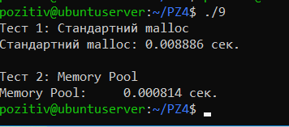

Опис реалізації:
- Для тесту було реалізовано механізм, де замість мільйона окремих викликів `malloc`, програма один раз виділяє великий блок пам'яті (пул).
- Видача пам'яті з пулу відбувається шляхом простого зміщення вказівника на розмір об'єкта, що виключає системні витрати на пошук вільного місця.

Результати тестування (на основі отриманих даних):
- Стандартний `malloc`: 0.008886 сек.
- `Memory Pool`: 0.000814 сек.

Висновок: Експеримент підтвердив, що спеціалізовані методи керування пам'яттю `Memory Pools` значно перевершують універсальний `malloc` у задачах з масовою алокацією однакових структур.
