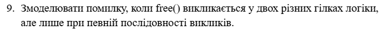
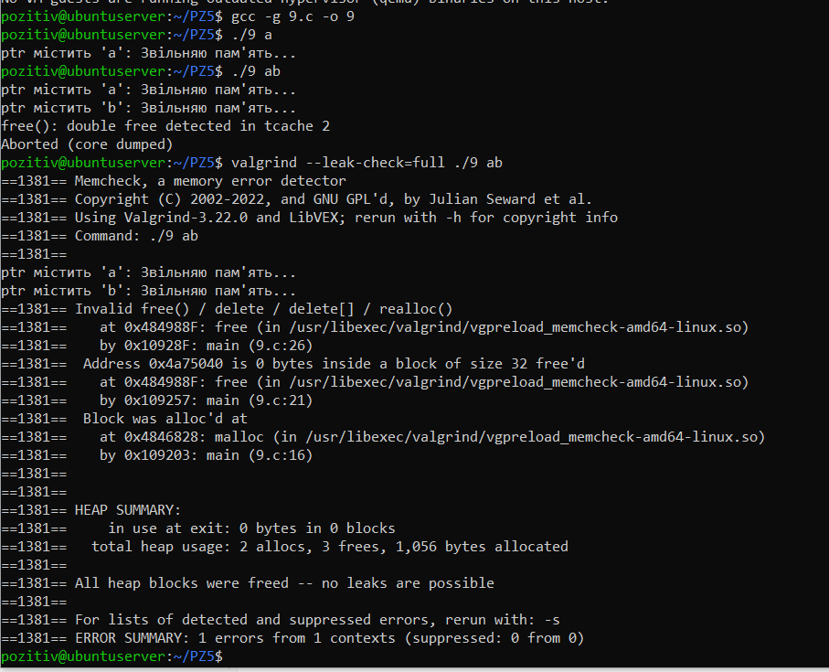

# Варіант №9



#### Мета завдання

Змоделювати та проаналізувати помилку подвійного звільнення пам'яті `double free`, яка виникає внаслідок некоректної логіки розгалуження програми, коли функція `free()` викликається двічі для однієї адреси.

#### Опис реалізації

Для виконання завдання було написано програму на мові C (9.c), де:
- Пам'ять виділяється динамічно за допомогою `malloc`.
- Програма перевіряє вхідний аргумент на наявність символів `a` та `b`.
- Якщо передано рядок `ab`, програма заходить у дві різні гілки логіки послідовно, в кожній з яких викликається `free()` для одного і того ж вказівника.

`"9.с":`
``` C
#include <stdio.h>
#include <stdlib.h>
#include <string.h>

int main(int argc, char *argv[]) {
    if (argc < 2) {
        printf("Помилка: Не вказано аргументів\n");
        return 1;
    }

    if (argc > 2) {
        printf("Помилка: Занадто багато аргументів\n");
        return 1;
    }

    char *ptr = malloc(32);
    strcpy(ptr, "буфер");

    if (strchr(argv[1], 'a')) {
        printf("ptr містить 'a': Звільняю пам'ять...\n");
        free(ptr);
    }

    if (strchr(argv[1], 'b')) {
        printf("ptr містить 'b': Звільняю пам'ять...\n");
        free(ptr);
    }

    return 0;
}
```

Результат:



1. Звичайний запуск: При введенні `./9 ab` система Linux виявила помилку захисту пам'яті: `free(): double free detected in tcache 2` та перервала виконання програми `(Aborted (core dumped))`

2. Запуск під Valgrind: Інструмент зафіксував помилку `Invalid free()`.
- Перше звільнення: Відбулося у файлі `9.c` на рядку `21`.
- Повторне (помилкове) звільнення: Відбулося на рядку `26`.
- Адреса блоку: `0x4a75040` (розмір 32 байти), який був успішно виділений на рядку `16`.

#### Висновок
Експеримент підтвердив, що подвійне звільнення пам'яті є критичною помилкою, яка призводить до негайної зупинки процесу. `Valgrind` є ефективним засобом для точного визначення місця виникнення таких багів, показуючи не тільки місце помилки, а й місце попереднього успішного звільнення та первинного виділення пам'яті.
