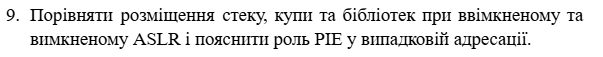
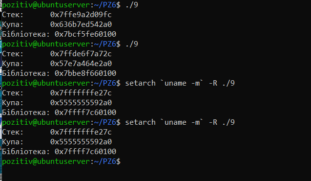

# Варіант №9



#### Мета завдання

Дослідити розміщення сегментів стеку, купи та динамічних бібліотек у віртуальній пам'яті процесу, а також проаналізувати роботу механізму рандомізації `ASLR`

##### Що таке ASLR?

ASLR — це технологія, яка при кожному новому запуску програми розміщує її частини (стек, купу, бібліотеки) за випадковими адресами.

###### Навіщо це треба? 
Якщо хакер знає точну адресу функції system() у пам'яті, він може спрямувати туди виконання коду. Якщо адреса кожного разу різна — атакувати значно важче.

##### Що таке PIE?
PIE — це тип виконуваного файлу, який може працювати незалежно від того, куди саме в пам'ять його завантажили. Без підтримки PIE сама програма завжди завантажуватиметься за однією адресою, навіть якщо ASLR увімкнено.

#### Опис реалізації

Було використано програму на мові `C`, яка виводить адреси пам'яті для:

- Локальної змінної (сегмент Stack).
- Динамічно виділеного блоку через `malloc()` (сегмент Heap).
- Стандартної функції `printf` (сегмент Shared Libraries).

`"9.с":`
``` C
#include <stdio.h>
#include <stdlib.h>

int main() {
    int stack_var;
    void *heap_var = malloc(10);

    printf("Стек:      %p\n", (void*)&stack_var);
    printf("Купа:      %p\n", heap_var);
    printf("Бібліотека: %p\n", (void*)&printf);

    free(heap_var);
    return 0;
}
```

Результат:



1. ASLR увімкнено (стандартний запуск)

При кожному новому виконанні адреси всіх сегментів змінюються випадковим чином. Це підтверджує активний захист від атак

2. ASLR вимкнено (через setarch)

Адреси стали статичними. Це демонструє базовий розподіл віртуальної пам'яті, де сегменти завжди завантажуються в одні й ті самі області.

#### Аналіз ролі PIE
У ході виконання було з'ясовано, що PIE дозволяє самому виконуваному файлу бути завантаженим за випадковою адресою, аналогічно до спільних бібліотек. Якщо програма скомпільована з підтримкою PIE, адреса функції main також буде змінюватися при активованому ASLR, що створює повний рівень захисту адресного простору.

