# Завдання №1

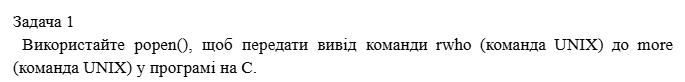

`"1.с":`
``` C
#include <stdio.h>
#include <stdlib.h>

int main() {
    FILE *pipe_in, *pipe_out;
    char buffer[1024];

    pipe_in = popen("ls -la /etc", "r");
    if (pipe_in == NULL) {
        perror("Помилка відкриття rwho");
        return 1;
    }

    pipe_out = popen("more", "w");
    if (pipe_out == NULL) {
        perror("Помилка відкриття more");
        pclose(pipe_in);
        return 1;
    }

    while (fgets(buffer, sizeof(buffer), pipe_in) != NULL) {
        fputs(buffer, pipe_out);
    }

    pclose(pipe_in);
    pclose(pipe_out);

    return 0;
}
```

Результат:

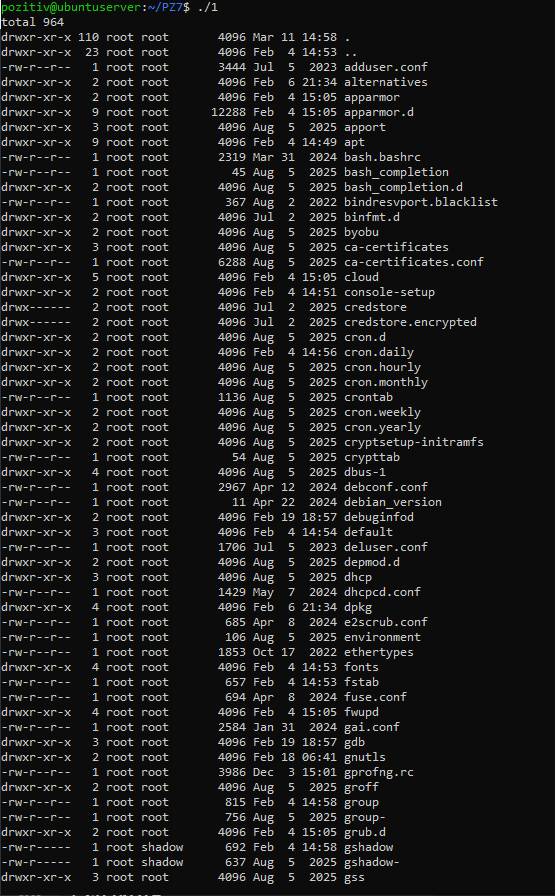

Програма успішно скомпілювалася з прапорцем `-Wall`. Під час запуску отримано список файлів директорії `/etc`, який передано в утиліту 'more', що підтверджує коректну роботу міжпроцесної взаємодії через конвеєри.

# Завдання №2

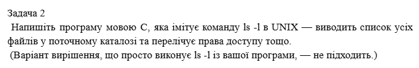

`"2.с":`
``` C
#include <stdio.h>
#include <dirent.h>    
#include <sys/stat.h>

int main() {
    DIR *dir;
    struct dirent *entry;
    struct stat file_stat;

    dir = opendir(".");
    if (dir == NULL) {
        perror("Неможливо відкрити каталог");
        return 1;
    }

    while ((entry = readdir(dir)) != NULL) {
        if (stat(entry->d_name, &file_stat) == 0) {

            printf(" %8lld", (long long)file_stat.st_size);

            printf(" %s\n", entry->d_name);
        }
    }

    closedir(dir);
    return 0;
}
```

Результат:

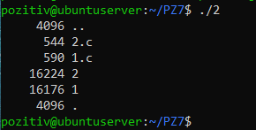

#### Хід виконання:

1. Робота з ядром: Для отримання списку файлів використано функції `opendir()` та `readdir()`, які взаємодіють безпосередньо з низькорівневими сервісами ОС
2. Отримання метаданих: Для кожного знайденого файлу було викликано системну функцію `stat()`, яка повертає структуру з даними про файл (розмір, права доступу, власник тощо)
3. Вивід даних: Зі структури stat було вилучено поле `st_size` (розмір файлу в байтах) та виведено разом з іменем файлу `entry->d_name`

# Завдання №3

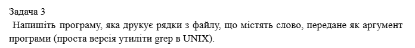

`"3.с":`
``` C
#include <stdio.h>
#include <string.h>
#include <stdlib.h>

int main(int argc, char *argv[]) {
    FILE *file;
    char line[1024];

    if (argc < 3) {
        printf("Використання: %s <слово> <назва_файлу>\n", argv[0]);
        return 1;
    }

    file = fopen(argv[2], "r");
    if (file == NULL) {
        perror("Помилка відкриття файлу");
        return 1;
    }

    while (fgets(line, sizeof(line), file) != NULL) {
        if (strstr(line, argv[1]) != NULL) {
            printf("%s", line);
        }
    }

    fclose(file);
    return 0;
}
```

Результат:

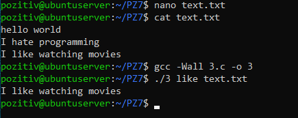

#### Хід виконання:

1. Обробка аргументів: Використано параметри argc та argv для отримання пошукового запиту та шляху до файлу безпосередньо під час запуску програми
2. Файлові операції: Застосовано функцію `fopen()` у режимі читання `"r"` та `fgets()` для зчитування вмісту файлу рядок за рядком
3. Алгоритм пошуку: Для аналізу кожного рядка використано функцію `strstr()` з бібліотеки `string.h`, яка виконує пошук підрядка в рядку

# Завдання №4

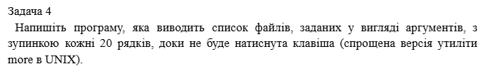

`"4.с":`
``` C
#include <stdio.h>
#include <stdlib.h>

int main(int argc, char *argv[]) {
    FILE *file;
    char line[1024];
    int line_count = 0;

    if (argc < 2) {
        printf("Використання: %s <файл1> <файл2> ...\n", argv[0]);
        return 1;
    }

    for (int i = 1; i < argc; i++) {
        file = fopen(argv[i], "r");
        if (file == NULL) {
            perror("Помилка відкриття файлу");
            continue;
        }

        printf("--- Файл: %s ---\n", argv[i]);

        while (fgets(line, sizeof(line), file) != NULL) {
            printf("%s", line);
            line_count++;

            if (line_count >= 20) {
                printf("\n-- Натисніть ENTER, щоб продовжити --");
                getchar(); 
                line_count = 0;
            }
        }
        fclose(file);
    }

    return 0;
}
```

Результат:

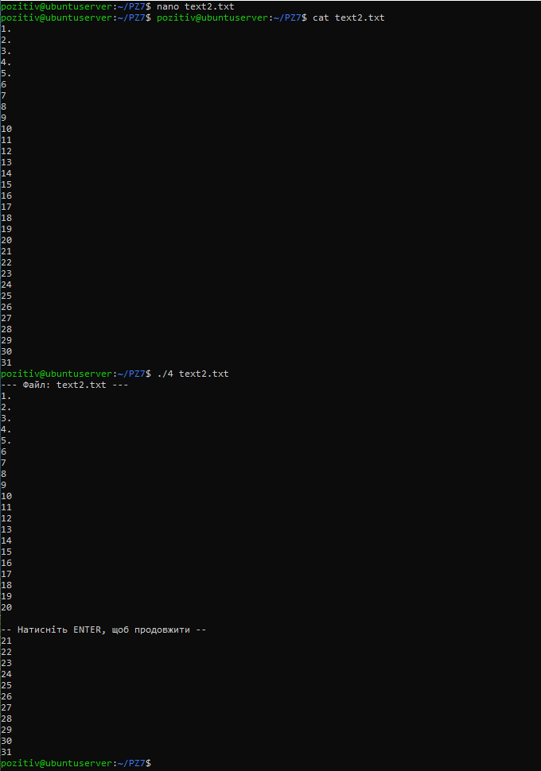

#### Хід виконання:

1. Обробка множинних аргументів: Реалізовано цикл `for`, який проходить по масиву argv, дозволяючи послідовно зчитувати кілька файлів
2. Керування виводом: Використано лічильник рядків `line_count`, який інкрементується при кожному виклику `printf`
3. Реалізація паузи: При досягненні лічильником значення `20` викликається функція `getchar()`. Це блокуюча операція, яка призупиняє процес, поки в стандартний потік введення не надійде символ (натискання Enter)

# Завдання №5

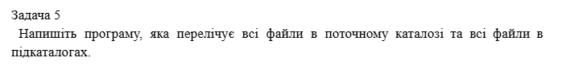

`"5.с":`
``` C
#include <stdio.h>
#include <dirent.h>
#include <sys/stat.h>
#include <string.h>

void list_dir_recursive(const char *base_path) {
    char path[1024];
    struct dirent *entry;
    struct stat file_stat;
    DIR *dir = opendir(base_path);

    if (!dir) return;

    while ((entry = readdir(dir)) != NULL) {
        if (strcmp(entry->d_name, ".") == 0 || strcmp(entry->d_name, "..") == 0)
            continue;

        snprintf(path, sizeof(path), "%s/%s", base_path, entry->d_name);

        if (stat(path, &file_stat) == 0) {
            printf("%s\n", path);

            if (S_ISDIR(file_stat.st_mode)) {
                list_dir_recursive(path);
            }
        }
    }
    closedir(dir);
}

int main() {
    list_dir_recursive(".");
    return 0;
}
```

Результат:

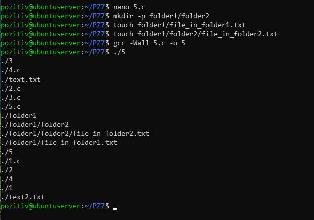

#### Хід виконання:

1. Реалізація рекурсії: Створено функцію `list_dir_recursive`, яка приймає шлях до каталогу як аргумент.
2. Системні виклики:

- Використано `opendir()` та `readdir()` для отримання списку об'єктів у директорії.
- Використано `stat()` для визначення типу об'єкта (файл чи папка).

3. Логіка обходу:

- Програма ігнорує службові записи `.` та `..`, щоб уникнути зациклення.
- Якщо виявлено директорію `S_ISDIR`, функція викликає саму себе для знайденого шляху.
- Для формування коректних шляхів використано `snprintf`.

# Завдання №6

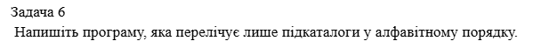

`"6.с":`
``` C
#include <stdio.h>
#include <stdlib.h>
#include <dirent.h>
#include <sys/stat.h>
#include <string.h>


int filter_directories(const struct dirent *entry) {
    struct stat file_stat;

    if (strcmp(entry->d_name, ".") == 0 || strcmp(entry->d_name, "..") == 0)
        return 0;


    if (stat(entry->d_name, &file_stat) == 0) {
        return S_ISDIR(file_stat.st_mode);
    }
    return 0;
}

int main() {
    struct dirent **namelist;
    int n;

    n = scandir(".", &namelist, filter_directories, alphasort);

    if (n < 0) {
        perror("scandir");
        return 1;
    } else if (n == 0) {
        printf("Підкаталогів не знайдено.\n");
    } else {
        printf("Список підкаталогів у алфавітному порядку:\n");
        for (int i = 0; i < n; i++) {
            printf("%s\n", namelist[i]->d_name);
            free(namelist[i]);
        }
        free(namelist);
    }

    return 0;
}
```

Результат:

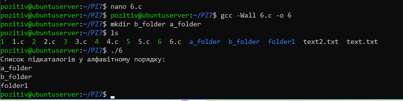

#### Хід виконання:

1. Вибір системного інструментарію: Використано функцію `scandir()`, яка поєднує в собі відкриття каталогу, читання вмісту, фільтрацію та сортування.
2. Розробка фільтра: Написано функцію `filter_directories`, яка використовує системний виклик `stat()` для перевірки прапорця `S_ISDIR`. Це дозволяє відділити папки від звичайних файлів.
3. Сортування: В якості аргументу для `scandir` передано стандартну бібліотечну функцію `alphasort`.
4. Керування пам'яттю: Оскільки `scandir` динамічно виділяє пам'ять для кожного запису `dirent`, реалізовано цикл для звільнення пам'яті `free` після виводу результатів

# Завдання №7

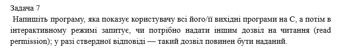

`"7.с":`
``` C
#include <stdio.h>
#include <dirent.h>
#include <sys/stat.h>
#include <string.h>

int main() {
    DIR *dir;
    struct dirent *entry;
    struct stat file_stat;
    char choice;

    dir = opendir(".");
    if (dir == NULL) {
        perror("Не вдалося відкрити каталог");
        return 1;
    }

    printf("Перевірка вихідних файлів C...\n");

    while ((entry = readdir(dir)) != NULL) {
        char *dot = strrchr(entry->d_name, '.');
        if (dot && strcmp(dot, ".c") == 0) {
            
            printf("Файл: %s. Надати дозвіл на читання іншим? (y/n): ", entry->d_name);
            scanf(" %c", &choice);

            if (choice == 'y' || choice == 'Y') {
                if (stat(entry->d_name, &file_stat) == 0) {
                    if (chmod(entry->d_name, file_stat.st_mode | S_IROTH) == 0) {
                        printf("Дозвіл для %s оновлено.\n", entry->d_name);
                    } else {
                        perror("Помилка");
                    }
                }
            }
        }
    }

    closedir(dir);
    return 0;
}
```

Результат:

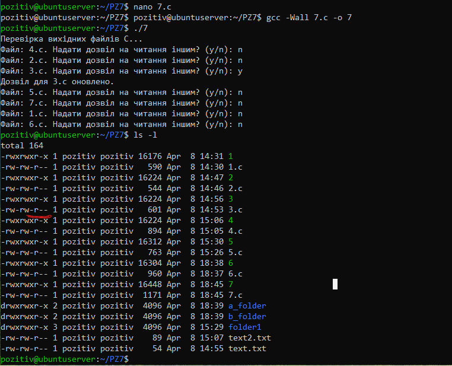

#### Хід виконання:

1. Пошук файлів: Використано функції `opendir()` та `readdir()` для сканування каталогу. Для ідентифікації потрібних файлів використано функцію `strrchr()` яка перевіряє розширення файлу на відповідність `.c`
2. Інтерактивний діалог: Реалізовано запит до користувача через `scanf()`. Програма обробляє відповіді `y` або `Y` як ствердні.
3. Модифікація прав:
   - Використано системний виклик `stat()` для отримання поточного стану (маски прав) файлу.
   - Використано системний виклик `chmod()` разом із побітовою операцією АБО (|) для додавання прапорця `S_IROTH` (читання для інших) до існуючих прав файлу.
4. Верифікація: Після виконання програми перевірка через `ls -l` підтвердила появу дозволу `r` (read) у відповідній групі прав для вибраного файлу `3.c`

# Завдання №8

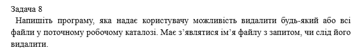

`"8.с":`
``` C
#include <stdio.h>
#include <dirent.h>
#include <sys/stat.h>
#include <unistd.h>
#include <string.h>

int main() {
    DIR *dir;
    struct dirent *entry;
    struct stat file_stat;
    char choice;

    dir = opendir(".");
    if (dir == NULL) {
        perror("Не вдалося відкрити каталог");
        return 1;
    }

    printf("--- Режим інтерактивного видалення файлів ---\n");

    while ((entry = readdir(dir)) != NULL) {
        if (stat(entry->d_name, &file_stat) == 0) {
            
            if (S_ISREG(file_stat.st_mode)) {
                
                if (strcmp(entry->d_name, "8") == 0 || strcmp(entry->d_name, "task8.c") == 0) {
                    continue;
                }

                printf("Видалити файл '%s'? (y/n): ", entry->d_name);
                scanf(" %c", &choice);

                if (choice == 'y' || choice == 'Y') {
                    if (unlink(entry->d_name) == 0) {
                        printf("Файл '%s' видалено.\n", entry->d_name);
                    } else {
                        perror("Помилка при видаленні");
                    }
                }
            }
        }
    }

    closedir(dir);
    return 0;
}
```

Результат:

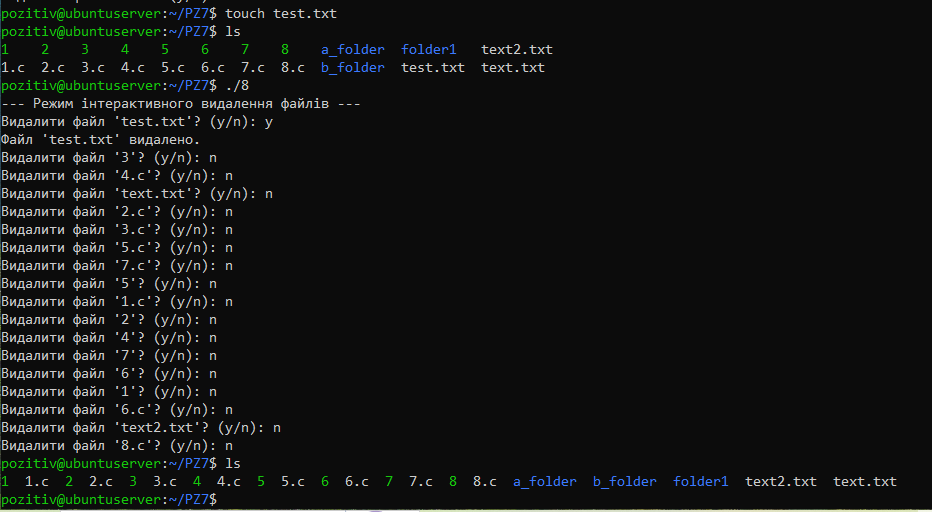

#### Хід виконання:

1. Сканування каталогу: Використано системні виклики `opendir()` та `readdir()` для отримання переліку всіх об'єктів у поточній директорії.
2. Фільтрація за типом: За допомогою функції `stat()` та макросу `S_ISREG` програма ідентифікує лише звичайні файли, ігноруючи підкаталоги.
3. Реалізація діалогу: Перед кожною критичною операцією програма виводить ім'я файлу та очікує символ підтвердження `(y/n)` від користувача.
4. Видалення: При отриманні позитивної відповіді виконується системний виклик `unlink()`, який видаляє посилання на файл із файлової системи.

# Завдання №9

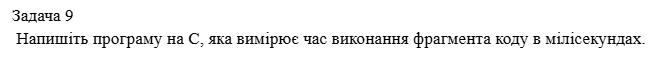

`"9.с":`
``` C
#include <stdio.h>
#include <sys/time.h>
#include <unistd.h>

int main() {
    struct timeval start, end;
    long seconds, useconds;
    double mtime;

    gettimeofday(&start, NULL);

    printf("Виконується фрагмент коду...\n");
    usleep(100000);

    gettimeofday(&end, NULL);

    seconds  = end.tv_sec  - start.tv_sec;
    useconds = end.tv_usec - start.tv_usec;

    mtime = ((seconds) * 1000 + useconds/1000.0);

    printf("Час виконання фрагмента коду: %.3f мілісекунд\n", mtime);

    return 0;
}
```

Результат:

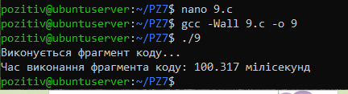

Програма показала `100.317 мс`. Ці додаткові `0.317 мс` — це саме той час, який знадобився ядру `Linux`, щоб викликати функцію `printf`, обробити системний виклик `usleep` та повернути керування програмі.

# Завдання №10

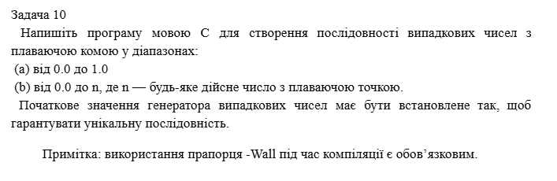

`"10.с":`
``` C
#include <stdio.h>
#include <stdlib.h>
#include <time.h>

int main() {
    float n;
    int count = 5;

    srand(time(NULL));

    printf("Введіть число n для діапазону (0.0 - n): ");
    if (scanf("%f", &n) != 1) {
        printf("Помилка введення\n");
        return 1;
    }

    printf("\n(a) Випадкові числа від 0.0 до 1.0:\n");
    for (int i = 0; i < count; i++) {
        float r = (float)rand() / (float)RAND_MAX;
        printf("%f\n", r);
    }

    printf("\n(b) Випадкові числа від 0.0 до %.2f:\n", n);
    for (int i = 0; i < count; i++) {
        float r = ((float)rand() / (float)RAND_MAX) * n;
        printf("%f\n", r);
    }

    return 0;
}
```

Результат:

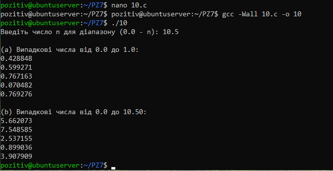

#### Хід виконання:

1. Ініціалізація генератора: Використано функцію `srand()` із системним часом `time(NULL)` як "зерном" (seed).  Це гарантує, що при кожному новому запуску програми послідовність чисел буде іншою
2. Генерація в діапазоні `0.0, 1.0`: Використано функцію `rand()`, результат якої нормалізовано шляхом ділення на константу `RAND_MAX`
3. Генерація в діапазоні `0.0, n`: Отримане нормалізоване число помножено на введене користувачем дійсне число `n`


# Варіант №9

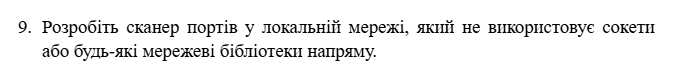

`"99.с":`
``` C
#include <stdio.h>
#include <stdlib.h>

int main() {
    char ip[16];
    int start_port, end_port;
    char command[256];

    printf("--- Сканер портів (через системні виклики) ---\n");
    printf("Введіть IP-адресу (напр. 127.0.0.1): ");
    scanf("%15s", ip);
    printf("Початковий порт: ");
    scanf("%d", &start_port);
    printf("Кінцевий порт: ");
    scanf("%d", &end_port);


    for (int port = start_port; port <= end_port; port++) {
        snprintf(command, sizeof(command), 
                 "timeout 1 bash -c 'cat < /dev/null > /dev/tcp/%s/%d' 2>/dev/null", 
                 ip, port);

        int result = system(command);

        if (result == 0) {
            printf("[+] Порт %d ВІДКРИТИЙ\n", port);
        }
    }

    return 0;
}
```

Результат:

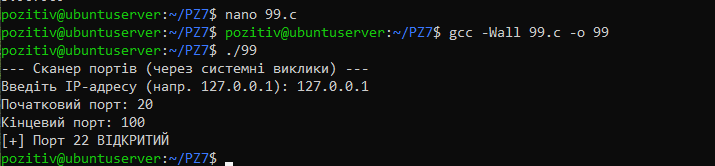

Під час тестування програми-сканера я ввів локальну IP-адресу `127.0.0.1` (localhost) та вказав діапазон портів від `20` до `100`. Програма проаналізувала кожен порт у цьому проміжку і виявила, що порт `22` перебуває у стані ВІДКРИТИЙ.

##### Чому так сталося і що це означає?

- Порт `22`: У системах `Linux` цей порт зарезервований для служби `SSH`. Оскільки я працюю на віртуальному сервері `Ubuntu`, ця служба автоматично запущена, щоб дозволяти віддалене керування системою через консоль.
- Локальна адреса `127.0.0.1`: Це стандартна зарезервована адреса ("loopback"), яка вказує на саму віртуальну машину. 

