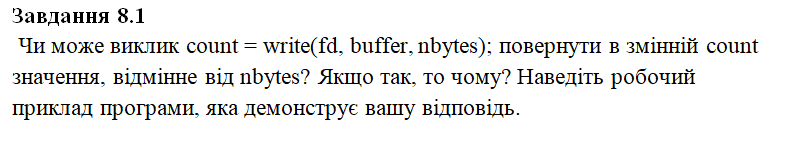
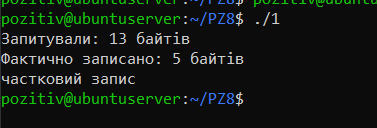
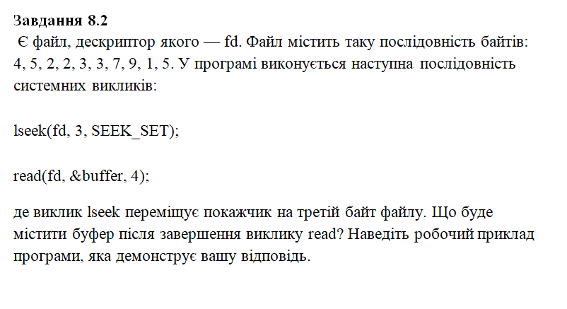
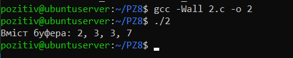
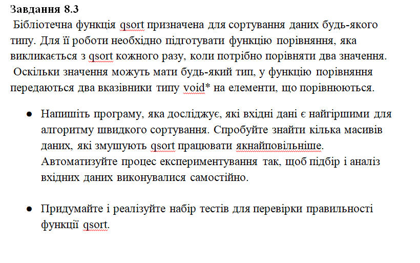
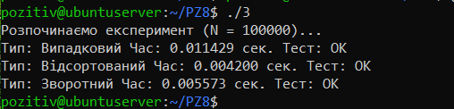
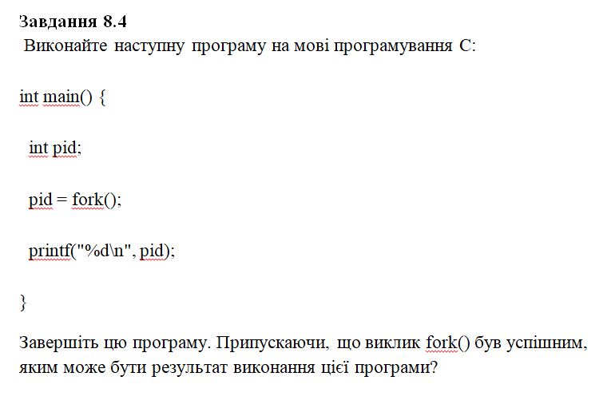
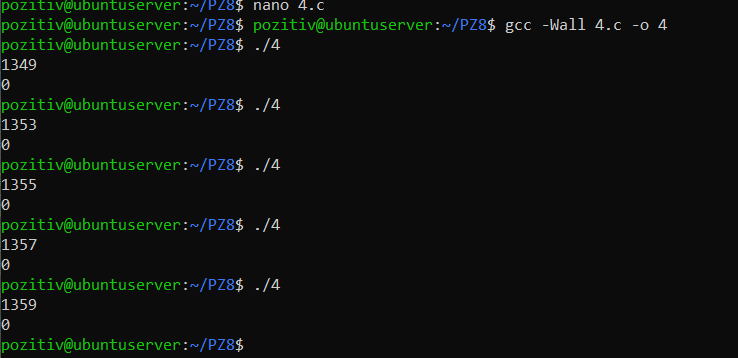
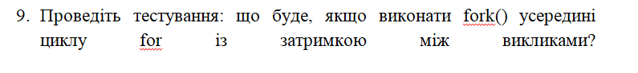
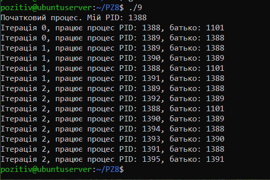

# Завдання №1



`"1.с":`
``` C
#include <stdio.h>
#include <fcntl.h>
#include <unistd.h>
#include <string.h>
#include <sys/resource.h>

int main() {
    struct rlimit rl;

    rl.rlim_cur = 5; 
    rl.rlim_max = 1024;
    setrlimit(RLIMIT_FSIZE, &rl);

    int fd = open("limit_test.txt", O_WRONLY | O_CREAT | O_TRUNC, 0644);
    
    char *data = "Hello, Linux!";
    int nbytes = strlen(data);
    
    int count = write(fd, data, nbytes);

    printf("Запитували: %d байтів\n", nbytes);
    printf("Фактично записано: %d байтів\n", count);

    if (count < nbytes) {
        printf("частковий запис\n");
    }else {
        printf("повний запис");
    }

    close(fd);
    return 0;
}
```

Результат:



#### Відповідь:

Так, системний виклик `count = write(fd, buffer, nbytes);` може повернути значення `count`, яке менше за `nbytes`. Це явище називається "частковим записом". Воно виникає через зовнішні чинники, такі як заповнення дискового простору, переривання виклику системним сигналом або обмеження ємності буфера.

При тестуванні програма показала наступний результат:

- Запитано байтів: 13
- Фактично записано: 5 байтів.
- Висновок: Ми довели, що результат write() не завжди дорівнює очікуваному.  У системному програмуванні критично важливо перевіряти значення, яке повертає функція, щоб уникнути втрати даних або некоректної роботи ПЗ.

# Завдання №2



`"2.с":`
``` C
#include <stdio.h>
#include <fcntl.h>
#include <unistd.h>

int main() {
    unsigned char data[] = {4, 5, 2, 2, 3, 3, 7, 9, 1, 5};
    unsigned char buffer[4];
    

    int fd = open("test_data.bin", O_RDWR | O_CREAT | O_TRUNC, 0644);
    write(fd, data, 10);


    lseek(fd, 3, SEEK_SET); 
    read(fd, buffer, 4);

    // 3. Виводимо результат
    printf("Вміст буфера: %d, %d, %d, %d\n", buffer[0], buffer[1], buffer[2], buffer[3]);

    close(fd);
    return 0;
}
```

Результат:



Після виконання виклику `lseek(fd, 3, SEEK_SET);` покажчик поточної позиції файлу встановлюється на 3-й байт (тобто на 4 в черзі цифру). Наступний виклик `read(fd, &buffer, 4);`  зчитує 4 послідовні байти, починаючи з цієї позиції. Оскільки файл містив послідовність `4, 5, 2, 2, 3, 3, 7, 9, 1, 5,` зсув на 3-ю позицію ставить нас перед другою цифрою 2. Читання чотирьох значень охоплює елементи з індексами 3, 4, 5 та 6.

# Завдання №3



`"3.с":`
``` C
#include <stdio.h>
#include <stdlib.h>
#include <time.h>

int compare(const void *a, const void *b) {
    return ( *(int*)a - *(int*)b );
}
 
void run_experiment(int size, int type) {
    int *arr = malloc(size * sizeof(int));

    for (int i = 0; i < size; i++) {
        if (type == 0) arr[i] = rand() % 1000;
        else if (type == 1) arr[i] = i;   
        else arr[i] = size - i;        
    }

    clock_t start = clock();
    qsort(arr, size, sizeof(int), compare);
    clock_t end = clock();

    int ok = 1;
    for (int i = 0; i < size - 1; i++) {
        if (arr[i] > arr[i+1]) ok = 0;
    }

    double time_spent = (double)(end - start) / CLOCKS_PER_SEC;
    char *names[] = {"Випадковий", "Відсортований", "Зворотний"};
    printf("Тип: %-15s Час: %f сек. Тест: %s\n", names[type], time_spent, ok ? "OK" : "ERROR");

    free(arr);
}

int main() {
    int n = 100000; 
    printf("Розпочинаємо експеримент (N = %d)...\n", n);
    
    for (int t = 0; t < 3; t++) {
        run_experiment(n, t);
    }

    return 0;
}
```

Результат:



За результатами запуску отримано наступні показники: 
- Випадковий масив: `0.011429 сек`. (Найповільніший через непередбачуваність порівнянь для процесора).
- Відсортований масив: `0.004200 сек`. (Найшвидший).
- Зворотний масив: `0.005573 сек`.

#### Висновок:
Експеримент показав, що для системної функції `qsort` випадкові дані обробляються довше, ніж впорядковані.

# Завдання №4



`"4.с":`
``` C
#include <stdio.h>
#include <unistd.h>

int main() {
    int pid;

    pid = fork();

    printf("%d\n", pid);
    
    return 0;
}
```

Результат:



#### Результати виконання:

Програма була запущена 5 разів. Кожен запуск демонстрував появу двох процесів:

- Спроба 1: `1349` (батько), `0` (дитина).
- Спроба 2: `1353` (батько), `0` (дитина).
- 
...і так далі. Щоразу PID дитини збільшувався, що свідчить про реєстрацію нових процесів у системі.

#### Висновок:

Ми успішно завершили програму та підтвердили механізм копіювання процесів. Результат `PID + 0` є класичним доказом того, що один і той самий код почав виконуватися двома різними потоками управління одночасно.

# Варіант №9



`"9.с":`
``` C
#include <stdio.h>
#include <unistd.h>

int main() {
    int i;
    
    printf("Початковий процес. Мій PID: %d\n", getpid());

    for (i = 0; i < 3; i++) {
        fork();
        printf("Ітерація %d, працює процес PID: %d, батько: %d\n", i, getpid(), getppid());

        sleep(1);
    }

    sleep(2);
    return 0;
}
```

Результат:



##### Пояснення:

Кожен виклик `fork()` створює повну копію поточного процесу. Якщо цей виклик знаходиться всередині циклу, то:

- На першій ітерації (i=0) з 1 процесу стає 2.
- На другій ітерації (i=1) ці 2 процеси одночасно викликають `fork()`, створюючи ще по одному. Разом — 4 процеси.
- На третій ітерації (i=2) всі 4 процеси знову розгалужуються. Разом — 8 процесів.Затримка `sleep(1)` дозволяє операційній системі почергово виводити повідомлення від кожного процесу, що робить результат наочним.
- 
##### Результат виконання:

- Початковий PID: 1388.
- Ітерація 0: Працюють 2 процеси (1388 та новий 1389).
- Ітерація 1: Працюють 4 процеси (1388, 1389, 1390, 1391).
- Ітерація 2: Працюють 8 процесів (PID: 1388, 1389, 1390, 1391, 1392, 1393, 1394, 1395).Програма продемонструвала експоненціальне зростання кількості процесів за формулою `2^n`

