# Завдання №1

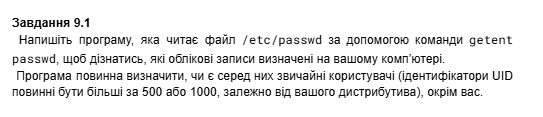

`"1.sh":`
``` SH
my_name=$(whoami)

echo "Шукаємо користувачів (UID >= 1000), окрім $my_name"

getent passwd | while IFS=: read -r username password uid gid info home shell
do
    if [ "$uid" -ge 1000 ]; then
        if [ "$username" != "$my_name" ]; then
            echo "Знайдено користувача: $username (UID: $uid)"
        fi
    fi
done
```

Результат:

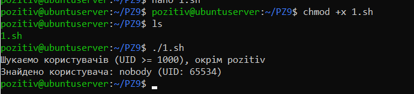

Програма успішно прочитала та проаналізувала список користувачів системи. Знайдено та виведено користувача `nobody` (UID: `65534`), який відповідає критеріям пошуку. Поточного користувача системи `pozitiv` було успішно виключено з результатів

# Завдання №2

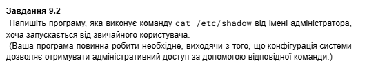

`"2.sh":`
``` SH
echo "Спроба прочитати секретний файл /etc/shadow..."

# Використовуємо sudo перед командою cat
sudo cat /etc/shadow

echo "Готово"
```

Результат:

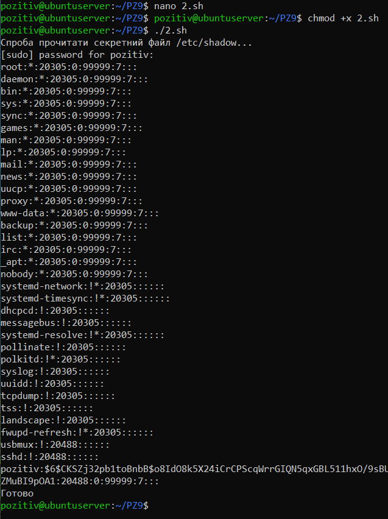


# Завдання №3

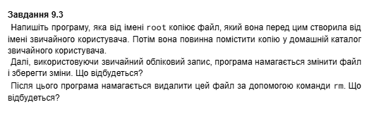

`"3.sh":`
``` SH
echo "1. Створюємо файл file.txt..."
echo "Текст від звичайного юзера" > file.txt

echo "2. Копіюємо файл від імені root (створюємо root_copy.txt)..."
sudo cp file.txt ~/root_copy.txt

echo "Власник скопійованого файлу:"
ls -l ~/root_copy.txt


echo "3. Спроба змінити файл від імені користувача"
echo "Новий рядок" >> ~/root_copy.txt


echo "4. Спроба видалити файл root_copy.txt..."
rm ~/root_copy.txt
```

Результат:

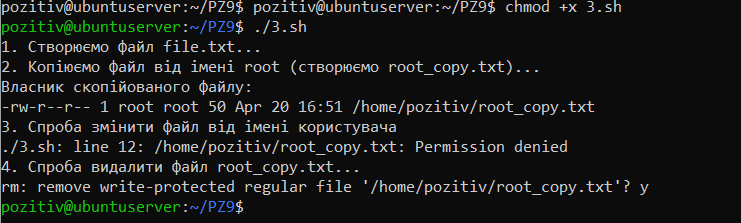

- Спроба змінити файл завершилася помилкою `Permission denied`, оскільки власником копії став `root`, а інші користувачі мають лише права на читання
- Спроба видалити файл виявилася успішною. Користувач зміг видалити файл (після підтвердження), оскільки він має права на запис до батьківського каталогу

# Завдання №4

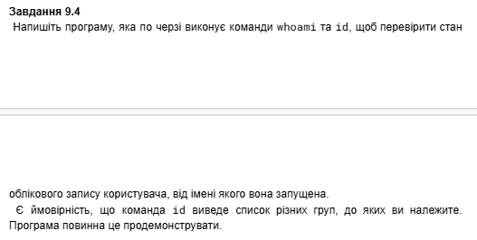

`"4.sh":`
``` SH
echo "Перевіряємо, від чийого імені запущено цей скрипт"

echo "Виконуємо команду whoami:"
whoami

echo "Виконуємо команду id (покаже UID, GID та всі групи):"
id

echo "Перевірку завершено!"
```

Результат:

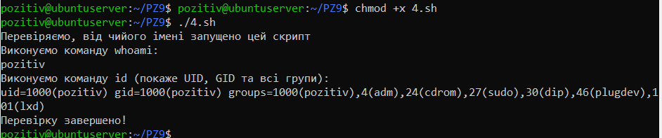

Команда `whoami` підтвердила ім'я користувача (`pozitiv`). Команда id вивела детальні дані, підтвердивши, що `UID` та `GID` дорівнюють `1000`. Також програма успішно продемонструвала належність користувача до додаткових системних груп, серед яких `adm`, `cdrom`, `sudo`

# Завдання №5

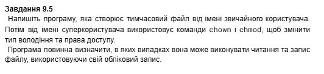

`"5.sh":`
``` SH
file="test_file.txt"

echo "1. Створюємо файл від імені користувача"
echo "текст" > $file

echo "Спробуємо його прочитати :"
cat $file

echo "2. Від імені root змінюємо власника файлу на root"
sudo chown root $file

echo "3. Від імені root ставимо права 600 (читати/писати може тільки власник)"
sudo chmod 600 $file

echo "4. Пробуємо прочитати файл від нашого імені (pozitiv):"
cat $file

echo "5. Спробуємо щось записати у файл від нашого імені (pozitiv):"
echo "Новий текст" >> $file

sudo rm $file
```

Результат:

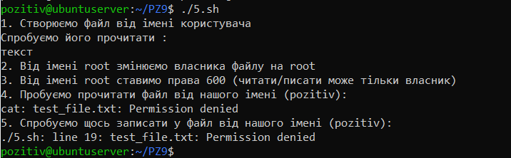

Зміна власника на `root` та встановлення прав `600` (доступ лише для власника) призвели до того, що звичайний користувач повністю втратив доступ до файлу. Спроби читання та запису завершилися системними повідомленнями про відмову в доступі `Permission denied`

# Завдання №6

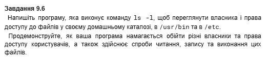

`"6.sh":`
``` SH
echo "1. Перегляд прав доступу (ls -ld)"
echo "Домашній каталог:"
ls -ld ~
echo "Каталог конфігурацій /etc (root):"
ls -ld /etc
echo "Каталог програм /usr/bin (root):"
ls -ld /usr/bin

echo ""
echo "2. Тестуємо папку /etc"
echo "Спроба ПРОЧИТАТИ /etc/hostname:"
cat /etc/hostname
echo "Спроба ЗАПИСАТИ в /etc/hostname:"
echo "new-name" >> /etc/hostname
echo "Спроба ВИКОНАТИ /etc/hostname:"
/etc/hostname

echo ""
echo "3. Тестуємо папку /usr/bin"
echo "Спроба ВИКОНАТИ /usr/bin/whoami:"
/usr/bin/whoami
echo "Спроба ЗАПИСАТИ в /usr/bin/whoami:"
echo "ламати" >> /usr/bin/whoami

echo ""
echo "4. Тестуємо домашній каталог"
echo "Створюємо свій файл my_script.sh"
echo 'GOOD' > ~/my_script.sh

echo "Спроба ПРОЧИТАТИ свій файл:"
cat ~/my_script.sh
echo "Спроба ЗАПИСАТИ в свій файл:"
echo "# новий коментар" >> ~/my_script.sh
echo "Спроба ВИКОНАТИ свій файл:"
~/my_script.sh
```

Результат:

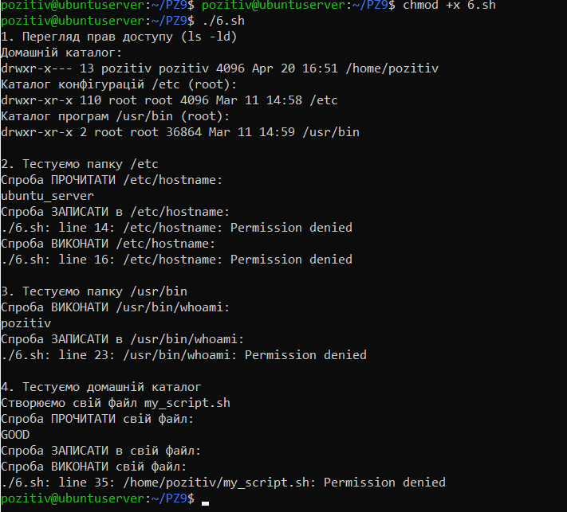

- Файл `/etc/hostname` доступний для читання, але захищений від запису та виконання (Permission denied)
- Утиліта `/usr/bin/whoami` успішно виконується, але захищена від модифікації звичайним користувачем
- Створений користувачем файл у домашньому каталозі доступний для читання та запису, але його виконання заблоковано системою через відсутність відповідного прапорця виконання (x)

# Варіант №9

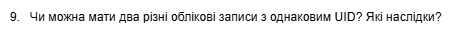

`"9.sh":`
``` C
sudo userdel user_a 2>/dev/null
sudo userdel user_b 2>/dev/null

echo "1. Створюємо користувача user_a з UID 1050"
sudo useradd -u 1050 user_a

echo "2. Створюємо користувача user_b з ТАКИМ САМИМ UID (1050)"
sudo useradd -o -u 1050 user_b

echo "3. Перевіряємо, як система їх бачить (команда id):"
echo "Для user_a:"
id user_a
echo "Для user_b:"
id user_b

echo "4. user_a створює свій приватний файл"
sudo -u user_a touch /tmp/shared_file.txt

echo "Дивимось, хто власник цього файлу (ls -l):"
ls -l /tmp/shared_file.txt

echo "5. user_b намагається записати туди текст"
sudo -u user_b bash -c 'echo "Я user_b!" > /tmp/shared_file.txt'

echo "Читаємо результат:"
cat /tmp/shared_file.txt

sudo userdel user_a
sudo userdel user_b
sudo rm /tmp/shared_file.txt
```

Результат:

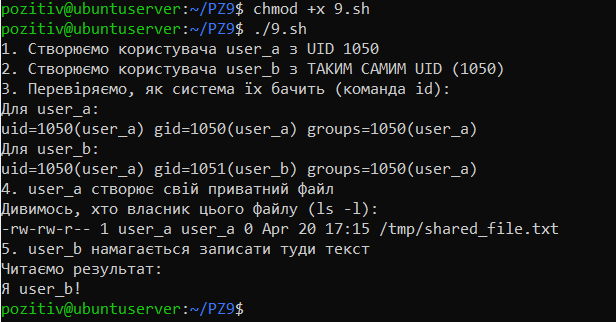

Так, це можливо. За допомогою ключа `-o` можна створити різних користувачів з однаковим `UID`.

Наслідки: Ядро `Linux` ідентифікує користувачів виключно за числовим `UID`. Оскільки номери збігаються, система сприймає обох користувачів як одного. Це призводить до того, що `user_b` має повний доступ до всіх файлів `user_a` (що було доведено успішним записом тексту у приватний файл). Крім того, виникає плутанина з іменами: при перевірці `user_b` система виводить ім'я `user_a`, оскільки воно є першим у системному списку для цього `UID`

